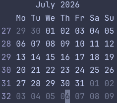

## A calendar for obsidian.nvim

This is a neovim plugin that adds a simple calendar window which can be used to open daily notes with [obsidian.nvim](https://github.com/obsidian-nvim/obsidian.nvim).

- Toggle calendar window with `:Calendar`
- Open to a specific year+month with `:Calendar YY[YY]-MM`.
- Open the daily note for the day under the cursor with `<CR>`. Requires `obsidian.nvim` installed




Does not currently offer configuration options, and does not consistently respect the user's locale.

### Installation

Does not require a `setup()` call

- with `vim.pack`:
  ```
  vim.pack.add({ "https://github.com/fleesk/obsidian-calendar.nvim" })
  ```
- with `lazy.nvim`:
  ```
  {
    'fleesk/obsidian-calendar.nvim',
  }
  ```
